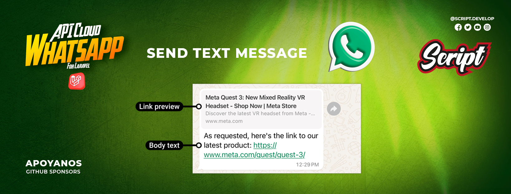
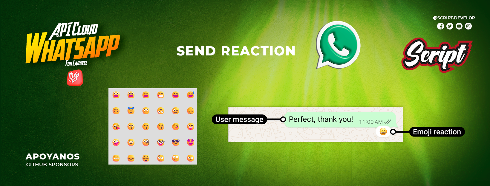
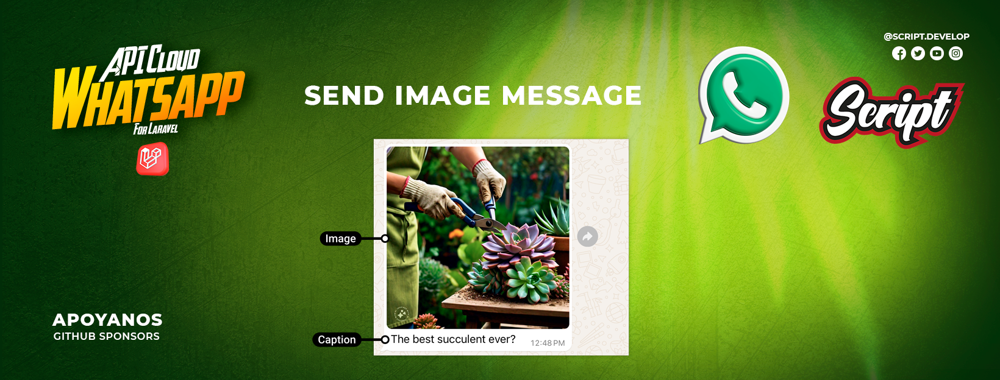
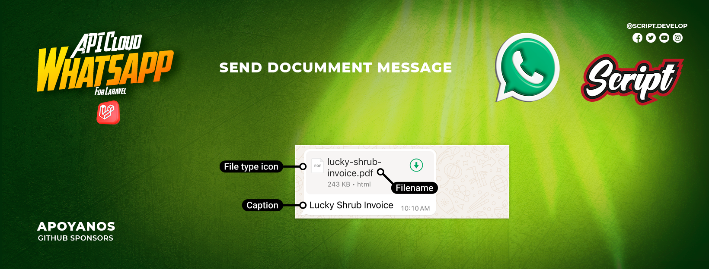
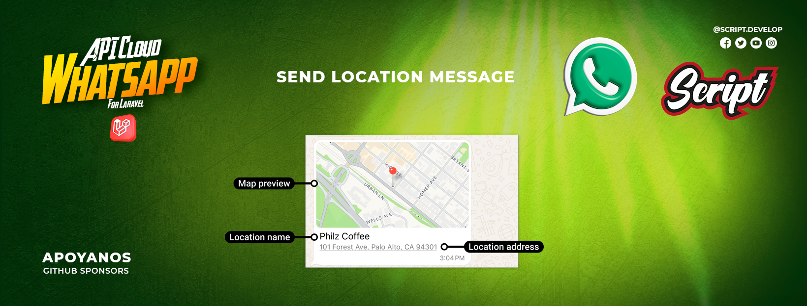

---

<div align="center">
<table>
  <tr>
    <td align="left">
      <a href="02-config-api.md" title="Sección anterior: Configuración">◄◄ Configurar API</a>
    </td>
    <td align="center">
      <a href="00-tabla-de-contenido.md" title="Tabla de contenido">▲ Tabla de contenido</a>
    </td>
    <td align="right">
      <a href="04-plantillas.md" title="Sección siguiente">Plantillas ►►</a>
    </td>
  </tr>
</table>
</div>

<div align="center">
<sub>Documentación del Webhook de WhatsApp Manager | 
<a href="https://github.com/djdang3r/whatsapp-api-manager">Ver en GitHub</a></sub>
</div>

---

## 💬 Gestión de Mensajes

### Introducción a la API de Mensajes
El módulo de mensajes proporciona una interfaz completa para enviar todo tipo de contenido a través de WhatsApp Business API. Desde simples mensajes de texto hasta complejos mensajes interactivos con productos, este módulo cubre todas las funcionalidades necesarias para una comunicación empresarial efectiva.

Características principales:
- Soporte para todos los tipos de mensajes de WhatsApp
- Envío mediante archivos locales o URLs
- Mensajes contextuales (respuestas, reacciones)
- Componentes interactivos (botones, listas)
- Integración con catálogos de productos
- Gestión de estado de mensajes

### 📚 Tabla de Contenidos
1. Mensajes Básicos
    - Texto simple
    - Texto con enlaces
    - Respuestas a mensajes "Reply"
    - Reacciones

2. Mensajes Multimedia
    - Imágenes
    - Stickers
    - Audio
    - Documentos

3. Mensajes de Ubicación
    - Mensajes de ubicación

4. Mensajes Interactivos
    - Botones
    - Listas desplegables

5. Mensajes de Productos
    - Producto individual
    - Múltiples productos
    - Catálogo completo

6. Gestión de Mensajes
    - Marcar como leído



## 1. Enviar Mensajes.
- **Envía mensajes de texto simples.**

    ```php
    use ScriptDevelop\WhatsappManager\Facades\Whatsapp;
    use ScriptDevelop\WhatsappManager\Models\WhatsappBusinessAccount;
    use ScriptDevelop\WhatsappManager\Models\WhatsappPhoneNumber;

    $account = WhatsappBusinessAccount::first();
    $phone = $account->phoneNumbers->first();

    $message = Whatsapp::message()->sendTextMessage(
        $phone->phone_number_id, // ID del número de teléfono
        '57',                        // Código de país
        '3237121901',                // Número de teléfono
        'Hola, este es un mensaje de prueba.' // Contenido del mensaje
    );
    ```

- **Enviar Mensajes de Texto con Enlaces**
    Envía mensajes de texto simples con link o enlace.

    ```php
    use ScriptDevelop\WhatsappManager\Facades\Whatsapp;
    use ScriptDevelop\WhatsappManager\Models\WhatsappBusinessAccount;
    use ScriptDevelop\WhatsappManager\Models\WhatsappPhoneNumber;

    $account = WhatsappBusinessAccount::first();
    $phone = $account->phoneNumbers->first();

    $message = Whatsapp::message()->sendTextMessage(
        $phone->phone_number_id, // ID del número de teléfono
        '57',                        // Código de país
        '3237121901',                // Número de teléfono
        'Visítanos en YouTube: http://youtube.com', // Enlace
        true // Habilitar vista previa de enlaces
    );
    ```


- **Enviar Respuestas a Mensajes**
    Responde a un mensaje existente.

    ```php
    use ScriptDevelop\WhatsappManager\Facades\Whatsapp;
    use ScriptDevelop\WhatsappManager\Models\WhatsappBusinessAccount;
    use ScriptDevelop\WhatsappManager\Models\WhatsappPhoneNumber;

    $account = WhatsappBusinessAccount::first();
    $phone = $account->phoneNumbers->first();

    $message = Whatsapp::message()->sendReplyTextMessage(
        $phone->phone_number_id, // ID del número de teléfono
        '57',                        // Código de país
        '3237121901',                // Número de teléfono
        'wamid.HBgMNTczMTM3MTgxOTA4FQIAEhggNzVCNUQzRDMxRjhEMUJEM0JERjAzNkZCNDk5RDcyQjQA', // ID del mensaje de contexto
        'Esta es una respuesta al mensaje anterior.' // Mensaje
    );
    ```




- **Enviar Reacciones a Mensajes**
    Envía una reacción a un mensaje existente.

    **Sintaxis Unicode requerida** 
    - Usa la codificación \u{código_hex} para emojis:

    ```php
    use ScriptDevelop\WhatsappManager\Facades\Whatsapp;
    use ScriptDevelop\WhatsappManager\Models\WhatsappBusinessAccount;
    use ScriptDevelop\WhatsappManager\Models\WhatsappPhoneNumber;

    $account = WhatsappBusinessAccount::first();
    $phone = $account->phoneNumbers->first();

    // Reacción con corazón rojo ❤️
    $message = Whatsapp::message()->sendReplyReactionMessage(
        $phone->phone_number_id, // ID del número de teléfono
        '57',                        // Código de país
        '3237121901',                // Número de teléfono
        'wamid.HBgMNTczMTM3MTgxOTA4FQIAEhggNzZENDMzMEI0MDRFQzg0OUUwRTI1M0JBQjEzMUZFRUYA', // ID del mensaje de contexto
        "\u{2764}\u{FE0F}" // Emoji de reacción
    );


    "\u{1F44D}" // 👍 (Me gusta)
    "\u{1F44E}" // 👎 (No me gusta)
    "\u{1F525}" // 🔥 
    "\u{1F60D}" // 😍
    "\u{1F622}" // 😢
    "\u{1F389}" // 🎉
    "\u{1F680}" // 🚀
    "\u{2705}" // ✅
    "\u{274C}" // ❌
    ```




## 2. Enviar Mensajes Multimedia.
- **Enviar Mensajes Multimedia**
    Enviar mensajes con Imágenes

    > ⚠️ **Advertencia:** Asegúrate de que la imagen que envíes cumpla con los requisitos de WhatsApp:  
    > - Formato soportado: JPEG, PNG  
    > - Tamaño máximo recomendado: 5 MB  
    > - Dimensiones recomendadas: al menos 640x640 px  
    > Si la imagen no cumple con estos requisitos, el envío puede fallar.

    ```php
    use ScriptDevelop\WhatsappManager\Facades\Whatsapp;
    use ScriptDevelop\WhatsappManager\Models\WhatsappBusinessAccount;
    use ScriptDevelop\WhatsappManager\Models\WhatsappPhoneNumber;

    $account = WhatsappBusinessAccount::first();
    $phone = $account->phoneNumbers->first();

    $filePath = storage_path('app/public/laravel-whatsapp-manager.png');
    $file = new \SplFileInfo($filePath);

    $message = Whatsapp::message()->sendImageMessage(
        $phone->phone_number_id, // ID del número de teléfono
        '57',                        // Código de país
        '3237121901',                // Número de teléfono
        $file                       // Archivo de imagen.
    );
    ```

- **Enviar Imágenes por URL**
    Enviar mensaaje con url de imagen.

    ```php
    use ScriptDevelop\WhatsappManager\Facades\Whatsapp;
    use ScriptDevelop\WhatsappManager\Models\WhatsappBusinessAccount;
    use ScriptDevelop\WhatsappManager\Models\WhatsappPhoneNumber;

    $account = WhatsappBusinessAccount::first();
    $phone = $account->phoneNumbers->first();

    $message = Whatsapp::message()->sendImageMessageByUrl(
        $phone->phone_number_id, // ID del número de teléfono
        '57',                        // Código de país
        '3237121901',                // Número de teléfono
        'https://example.com/image.png' // Enlace de imagen
    );
    ```


- **Enviar Sticker**
    Enviar mensajes con sticker.

    > ⚠️ **Advertencia:** Asegúrate de que el sticker que envíes cumpla con los requisitos de WhatsApp:  
    > - Formato soportado: WEBP  
    > - Tamaño máximo recomendado: 100 KB  
    > Si el sticker no cumple con estos requisitos, el envío puede fallar.

    ```php
    use ScriptDevelop\WhatsappManager\Facades\Whatsapp;
    use ScriptDevelop\WhatsappManager\Models\WhatsappBusinessAccount;
    use ScriptDevelop\WhatsappManager\Models\WhatsappPhoneNumber;

    $account = WhatsappBusinessAccount::first();
    $phone = $account->phoneNumbers->first();

    $filePath = storage_path('app/public/laravel-whatsapp-manager.png');
    $file = new \SplFileInfo($filePath);

    $message = Whatsapp::message()->sendStickerMessage(
        $phone->phone_number_id, // ID del número de teléfono
        '57',                        // Código de país
        '3237121901',                // Número de teléfono
        $file                       // Archivo de stiker
    );
    ```


- **Enviar Audio**
    Enviar mensajes con archivo de audio.

    > ⚠️ **Advertencia:** Asegúrate de que el archivo de audio que envíes cumpla con los requisitos de WhatsApp:  
    > - Formato soportado: AAC, MP4, MPEG, AMR, OGG.  
    > - Tamaño máximo recomendado: 16 MB  
    > Si el archivo de audio no cumple con estos requisitos, el envío puede fallar.
    
    ```php
    use ScriptDevelop\WhatsappManager\Facades\Whatsapp;
    use ScriptDevelop\WhatsappManager\Models\WhatsappBusinessAccount;
    use ScriptDevelop\WhatsappManager\Models\WhatsappPhoneNumber;

    $account = WhatsappBusinessAccount::first();
    $phone = $account->phoneNumbers->first();

    $filePath = storage_path('app/public/audio.ogg');
    $file = new \SplFileInfo($filePath);

    $message = Whatsapp::message()->sendAudioMessage(
        $phone->phone_number_id, // ID del número de teléfono
        '57',                        // Código de país
        '3237121901',                // Número de teléfono
        $file                       // Archivo de Audio
    );
    ```

- **Enviar Audio por URL**
    Enviar mensaje con Enlace de audio

    ```php
    use ScriptDevelop\WhatsappManager\Facades\Whatsapp;
    use ScriptDevelop\WhatsappManager\Models\WhatsappBusinessAccount;
    use ScriptDevelop\WhatsappManager\Models\WhatsappPhoneNumber;

    $account = WhatsappBusinessAccount::first();
    $phone = $account->phoneNumbers->first();

    $message = Whatsapp::message()->sendAudioMessageByUrl(
        $phone->phone_number_id, // ID del número de teléfono
        '57',                        // Código de país
        '3237121901',                // Número de teléfono
        'https://example.com/audio.ogg' // URL o Enlace
    );
    ```


- **Enviar Documentos**
    Enviar mensaje con Documento

    > ⚠️ **Advertencia:** Asegúrate de que el archivo de documento que envíes cumpla con los requisitos de WhatsApp:  
    > - Formatos soportados: PDF, DOC, DOCX, XLS, XLSX, PPT, PPTX, TXT, CSV, ZIP, RAR, entre otros.  
    > - Tamaño máximo recomendado: 100 MB  
    > Si el archivo no cumple con estos requisitos, el envío puede fallar.

    ```php
    use ScriptDevelop\WhatsappManager\Facades\Whatsapp;
    use ScriptDevelop\WhatsappManager\Models\WhatsappBusinessAccount;
    use ScriptDevelop\WhatsappManager\Models\WhatsappPhoneNumber;

    $account = WhatsappBusinessAccount::first();
    $phone = $account->phoneNumbers->first();

    $filePath = storage_path('app/public/document.pdf');
    $file = new \SplFileInfo($filePath);

    $message = Whatsapp::message()->sendDocumentMessage(
        $phone->phone_number_id, // ID del número de teléfono
        '57',                        // Código de país
        '3237121901',                // Número de teléfono
        $file                       // Archivo del documento
    );
    ```

- **Enviar Documentos por URL**
    Enviar mensaje de enlace de documento.

    ```php
    use ScriptDevelop\WhatsappManager\Facades\Whatsapp;
    use ScriptDevelop\WhatsappManager\Models\WhatsappBusinessAccount;
    use ScriptDevelop\WhatsappManager\Models\WhatsappPhoneNumber;

    $account = WhatsappBusinessAccount::first();
    $phone = $account->phoneNumbers->first();

    $message = Whatsapp::message()->sendDocumentMessageByUrl(
        $phone->phone_number_id, // ID del número de teléfono
        '57',                        // Código de país
        '3237121901',                // Número de teléfono
        'https://example.com/document.pdf' // URL o Enlace de documento
    );
    ```



## 3. Enviar Mensajes de Ubicación.
- **Enviar Mensajes de Ubicación**
    Envía un mensaje con coordenadas de ubicación.

    ```php
    use ScriptDevelop\WhatsappManager\Facades\Whatsapp;
    use ScriptDevelop\WhatsappManager\Models\WhatsappBusinessAccount;
    use ScriptDevelop\WhatsappManager\Models\WhatsappPhoneNumber;

    $account = WhatsappBusinessAccount::first();
    $phone = $account->phoneNumbers->first();

    // Ejemplo 1
    $message = Whatsapp::message()->sendLocationMessage(
        $phone->phone_number_id, // ID del número de teléfono
        '57',                        // Código de país
        '3237121901',                // Número de teléfono
        4.7110,                     // Latitud
        -74.0721,                   // Longitud
        'Bogotá',                   // Nombre del lugar
        'Colombia'                  // Dirección
    );

    // Ejemplo 2
    $message = Whatsapp::message()->sendLocationMessage(
        phoneNumberId: $phone->phone_number_id,
        countryCode: '57',                  // Código de país
        phoneNumber: '3137183308',          // Número de teléfono
        latitude: 19.4326077,               // Latitud
        longitude: -99.133208,              // Longitud
        name: 'Ciudad de México',           // Nombre del lugar
        address: 'Plaza de la Constitución' // Dirección
    );
    ```


## 4. Enviar Mensajes Interactivos.
- **Mensajes con Botones Interactivos**
    Enviar mensajes con botones interactivos:

    ```php
    use ScriptDevelop\WhatsappManager\Facades\Whatsapp;
    use ScriptDevelop\WhatsappManager\Models\WhatsappBusinessAccount;
    use ScriptDevelop\WhatsappManager\Models\WhatsappPhoneNumber;

    $account = WhatsappBusinessAccount::first();
    $phone = $account->phoneNumbers->first();

    //EJEMPLO 1
    $buttonResponse = Whatsapp::sendButtonMessage($phone->phone_number_id)
        ->to('57', '31371235638')
        ->withBody('¿Confirmas tu cita para mañana a las 3 PM?')
        ->addButton('confirmar', '✅ Confirmar')
        ->addButton('reagendar', '🔄 Reagendar')
        ->withFooter('Por favor selecciona una opción')
        ->send();
    
    //EJEMPLO 2
    $buttonResponse = Whatsapp::sendButtonMessage($phone->phone_number_id)
        ->to('57', '31371235638')
        ->withBody('¿Cómo calificarías nuestro servicio?')
        ->addButton('excelente', '⭐️⭐️⭐️⭐️⭐️ Excelente')
        ->addButton('bueno', '⭐️⭐️⭐️⭐️ Bueno')
        ->addButton('regular', '⭐️⭐️⭐️ Regular')
        ->withFooter('Tu opinión nos ayuda a mejorar')
        ->send();

    //EJEMPLO 3
    // Obtener ID de un mensaje anterior (debes tener uno real)
    $contextMessage = \ScriptDevelop\WhatsappManager\Models\Message::first();
    $contextId = $contextMessage->wa_id;

    $buttonResponse = Whatsapp::sendButtonMessage($phone->phone_number_id)
        ->to('57', '31371235638')
        ->withBody('Selecciona el tipo de soporte que necesitas:')
        ->addButton('soporte-tecnico', '🛠️ Soporte Técnico')
        ->addButton('facturacion', '🧾 Facturación')
        ->addButton('quejas', '📣 Quejas y Reclamos')
        ->withFooter('Horario de atención: L-V 8am-6pm')
        ->inReplyTo($contextId)  // Aquí especificas el mensaje al que respondes
        ->send();

    // EJEMPLOS CON HEADER texto
    $buttonResponse = Whatsapp::sendButtonMessage($phone->phone_number_id)
        ->to('57', '313714R3534')
        ->withHeader('Catálogo Digital')
        ->withBody('¿Confirmas tu cita para mañana a las 3 PM?')
        ->addButton('confirmar', '✅ Confirmar')
        ->addButton('reagendar', '🔄 Reagendar')
        ->withFooter('Por favor selecciona una opción')
        ->send();

    // EJEMPLOS CON HEADER imagen
    $file = new \SplFileInfo(storage_path('app/public/laravel-whatsapp-manager.png'));

    $buttonResponse = Whatsapp::sendButtonMessage($phone->phone_number_id)
        ->to('57', '313714R3534')
        ->withHeader($file)
        ->withBody('¿Confirmas tu cita para mañana a las 3 PM?')
        ->addButton('confirmar', '✅ Confirmar')
        ->addButton('reagendar', '🔄 Reagendar')
        ->withFooter('Por favor selecciona una opción')
        ->send();
    ```

- **Listas Desplegables Interactivas**
    Enviar mensajes con Listas desplegables interactivas:

    ```php
    use ScriptDevelop\WhatsappManager\Facades\Whatsapp;
    use ScriptDevelop\WhatsappManager\Models\WhatsappBusinessAccount;
    use ScriptDevelop\WhatsappManager\Models\WhatsappPhoneNumber;

    $account = WhatsappBusinessAccount::first();
    $phone = $account->phoneNumbers->first();

    // EJEMLPO 1 - SIN ENCADENAR
    $listBuilder = Whatsapp::sendListMessage($phone->phone_number_id)
        ->to('57', '31371235638')
        ->withButtonText('Ver Productos')
        ->withBody('Nuestros productos destacados:')
        ->withHeader('Catálogo Digital')
        ->withFooter('Desliza para ver más opciones');

    $listBuilder->startSection('Laptops')
        ->addRow('laptop-pro', 'MacBook Pro', '16" - 32GB RAM - 1TB SSD')
        ->addRow('laptop-air', 'MacBook Air', '13" - M2 Chip - 8GB RAM')
        ->endSection();

    $listBuilder->startSection('Smartphones')
        ->addRow('iphone-15', 'iPhone 15 Pro', 'Cámara 48MP - 5G')
        ->addRow('samsung-s23', 'Samsung S23', 'Pantalla AMOLED 120Hz')
        ->endSection();

    $response = $listBuilder->send();

    // EJEMLPO 2 - ENCADENADO
    $listBuilder = Whatsapp::sendListMessage($phone->phone_number_id)
        ->to('57', '31371235638')
        ->withButtonText('Ver Servicios')
        ->withBody('Selecciona el servicio que deseas agendar:')
        ->withFooter('Desliza para ver todas las opciones')
        ->startSection('Cortes de Cabello')
            ->addRow('corte-mujer', 'Corte Mujer', 'Estilo profesional')
            ->addRow('corte-hombre', 'Corte Hombre', 'Técnicas modernas')
            ->addRow('corte-niños', 'Corte Niños', 'Diseños infantiles')
        ->endSection()
        ->startSection('Tratamientos')
            ->addRow('keratina', 'Keratina', 'Tratamiento reparador')
            ->addRow('coloracion', 'Coloración', 'Tintes profesionales')
            ->addRow('mascarilla', 'Mascarilla', 'Hidratación profunda')
        ->endSection();

    $response = $listBuilder->send();


    // EJEMLPO 3 - respuesta a mensajes o reply
    // Obtener ID de un mensaje anterior (debes tener uno real)
    $contextMessage = \ScriptDevelop\WhatsappManager\Models\Message::first();
    $contextId = $contextMessage->wa_id;

    $listBuilder = Whatsapp::sendListMessage($phone->phone_number_id)
        ->to('57', '31371235638')
        ->withButtonText('Seleccionar Servicio')
        ->withBody('Para el tipo de cita que mencionaste, tenemos estas opciones:')
        ->inReplyTo($contextId); // Aquí especificas el mensaje al que respondes

    $listBuilder->startSection('Consultas')
        ->addRow('consulta-general', 'Consulta General', '30 min - $50.000')
        ->addRow('consulta-especial', 'Consulta Especializada', '60 min - $90.000')
        ->endSection();

    $listBuilder->startSection('Tratamientos')
        ->addRow('tratamiento-basico', 'Tratamiento Básico', 'Sesión individual')
        ->addRow('tratamiento-premium', 'Tratamiento Premium', 'Incluye seguimiento')
        ->endSection();

    $response = $listBuilder->send();

    // EJEMPLO CON HEADER texto
    $listBuilder = Whatsapp::sendListMessage($phone->phone_number_id)
        ->to('57', '313714R3534')
        ->withButtonText('Ver Productos')
        ->withHeader('Catálogo Digital') // HEADER DE TECTO
        ->withBody('Nuestros productos destacados:')
        ->withFooter('Desliza para ver más opciones')
        ->startSection('Laptops')
            ->addRow('laptop-pro', 'MacBook Pro', '16" - 32GB RAM - 1TB SSD')
            ->addRow('laptop-air', 'MacBook Air', '13" - M2 Chip - 8GB RAM')
        ->endSection()
        ->startSection('Smartphones')
            ->addRow('iphone-15', 'iPhone 15 Pro', 'Cámara 48MP - 5G')
            ->addRow('samsung-s23', 'Samsung S23', 'Pantalla AMOLED 120Hz')
        ->endSection()
        ->send();
    ```


- **Mensajes de botones URL de llamada a la acción interactivos**
    Enviar Mensajes de botones URL de llamada a la acción interactivos:

    ```php
    use ScriptDevelop\WhatsappManager\Facades\Whatsapp;
    use ScriptDevelop\WhatsappManager\Models\WhatsappPhoneNumber;
    $phone = WhatsappPhoneNumber::first();

    // Ejemplo básico
    Whatsapp::sendCtaUrlMessage($phone->phone_number_id)
        ->to('57', '31371235638')
        ->withBody('¡Visita nuestra nueva tienda online!')
        ->withButton('Ver Tienda', 'https://tienda.example.com')
        ->send();

    // Ejemplo con header y footer
    Whatsapp::sendCtaUrlMessage($phone->phone_number_id)
        ->to('57', '31371235638')
        ->withHeader('Oferta Especial')
        ->withBody('Descuento del 20% en todos los productos')
        ->withButton('Ver Oferta', 'https://tienda.example.com/ofertas')
        ->withFooter('Válido hasta fin de mes')
        ->send();

    // Ejemplo con header multimedia "Se debe usar un link de imagen publica para Image, Video, Documento"
    $imageUrl = 'https://play-lh.googleusercontent.com/1-hPxafOxdYpYZEOKzNIkSP43HXCNftVJVttoo4ucl7rsMASXW3Xr6GlXURCubE1tA=w3840-h2160-rw';

    Whatsapp::sendCtaUrlMessage($phone->phone_number_id)
        ->to('57', '31371235638')
        ->withHeader($imageUrl)
        ->withBody('¡Nueva colección disponible!')
        ->withButton('Ver Colección', 'https://tienda.example.com/nueva-coleccion')
        ->send();

    // Ejemplo como respuesta a otro mensaje
    $contextMessage = \ScriptDevelop\WhatsappManager\Models\Message::first();
    $contextId = $contextMessage->wa_id;

    Whatsapp::sendCtaUrlMessage($phone->phone_number_id)
        ->to('57', '31371235638')
        ->withBody('Aquí tienes el enlace que solicitaste:')
        ->withButton('Descargar Documento', 'https://example.com/documento.pdf')
        ->inReplyTo($contextId)
        ->send();
    ```


- **Mensajes de botones Interactivo de solicitud de ubicacion**
    Enviar Mensajes con boton de solicitud de ubicacion:

    ```php
    Whatsapp::sendLocationRequestMessage($phone->phone_number_id)
        ->to('57', '31371235638')
        ->withBody('Por favor comparte tu ubicación para ayudarte mejor')
        ->send();
    ```


## 5. Enviar Mensajes de Producto.
- **Mensaje de Producto Individual**
    Enviar mensaje de Producto Simple.

    ```php
    use ScriptDevelop\WhatsappManager\Facades\Whatsapp;
    use ScriptDevelop\WhatsappManager\Models\WhatsappBusinessAccount;
    use ScriptDevelop\WhatsappManager\Models\WhatsappPhoneNumber;

    $account = WhatsappBusinessAccount::first();
    $phone = $account->phoneNumbers->first();

    $productId = 'PROD-12345'; // ID del producto en tu catálogo

    // Enviar un solo producto con texto descriptivo
    WhatsappManager::message()->sendSingleProductMessage(
        $phone->phone_number_id,
        '52',         // Código de país (México)
        '5512345678', // Número de destino
        $productId,
        '¡Mira este increíble producto que tenemos para ti!'
    );
    ```

- **Mensaje con Múltiples Productos**
    Enviar mensaje de Multiples Productos.

    ```php
    use ScriptDevelop\WhatsappManager\Facades\Whatsapp;
    use ScriptDevelop\WhatsappManager\Models\WhatsappBusinessAccount;
    use ScriptDevelop\WhatsappManager\Models\WhatsappPhoneNumber;
    use ScriptDevelop\WhatsappManager\Services\CatalogProductBuilder;

    $account = WhatsappBusinessAccount::first();
    $phone = $account->phoneNumbers->first();

    $builder = new CatalogProductBuilder(
        WhatsappManager::getDispatcher(), 
        $phone->phone_number_id,
    );

    $builder->to('52', '5512345678')
        ->withBody('Productos recomendados para ti:')
        ->withHeader('Ofertas Especiales')
        ->withFooter('Válido hasta el 30 de Junio')
        
        // Sección 1
        ->startSection('Productos Destacados')
            ->addProduct('PROD-12345')
            ->addProduct('PROD-67890')
        ->endSection()
        
        // Sección 2
        ->startSection('Nuevos Lanzamientos')
            ->addProduct('PROD-54321')
            ->addProduct('PROD-09876')
        ->endSection()
        
        ->send();
    ```

- **Mensaje de Catálogo Completo**
    Enviar mensaje de Catalogo completo.

    ```php
    use ScriptDevelop\WhatsappManager\Facades\Whatsapp;
    use ScriptDevelop\WhatsappManager\Models\WhatsappBusinessAccount;
    use ScriptDevelop\WhatsappManager\Models\WhatsappPhoneNumber;
    use ScriptDevelop\WhatsappManager\Services\CatalogProductBuilder;

    $account = WhatsappBusinessAccount::first();
    $phone = $account->phoneNumbers->first();

    WhatsappManager::message()->sendFullCatalogMessage(
        $phone->phone_number_id,
        '52',
        '5512345678',
        'Ver Catálogo',      // Texto del botón
        'Explora nuestro catálogo completo de productos',
        '¡Envíanos un mensaje para más información!' // Footer
    );
    ```

- **Mensaje de Producto como Respuesta o Replica**
    Enviar mensaje de Producto simple con replica o contecto.

    ```php
    use ScriptDevelop\WhatsappManager\Facades\Whatsapp;
    use ScriptDevelop\WhatsappManager\Models\WhatsappBusinessAccount;
    use ScriptDevelop\WhatsappManager\Models\WhatsappPhoneNumber;
    use ScriptDevelop\WhatsappManager\Services\CatalogProductBuilder;

    $account = WhatsappBusinessAccount::first();
    $phone = $account->phoneNumbers->first();

    // Responder a un mensaje específico con un producto
    $contextMessageId = 'wamid.XXXXXX'; // ID del mensaje original

    WhatsappManager::message()->sendSingleProductMessage(
        $phone->phone_number_id,
        '52',
        '5512345678',
        'PROD-12345',
        'Este es el producto que mencionaste:',
        $contextMessageId
    );
    ```

- **Mensaje Interactivo con Productos (Avanzado)**
    Enviar mensaje de Productos Interactivos Avanzados y con Replica o contexto.

    ```php
    use ScriptDevelop\WhatsappManager\Facades\Whatsapp;
    use ScriptDevelop\WhatsappManager\Models\WhatsappBusinessAccount;
    use ScriptDevelop\WhatsappManager\Models\WhatsappPhoneNumber;
    use ScriptDevelop\WhatsappManager\Services\CatalogProductBuilder;

    $account = WhatsappBusinessAccount::first();
    $phone = $account->phoneNumbers->first();

    WhatsappManager::message()->sendMultiProductMessage(
        $phone->phone_number_id,
        '52',
        '5512345678',
        [
            [
                'title' => 'Ofertas',
                'product_items' => [
                    ['product_retailer_id' => 'PROD-123'],
                    ['product_retailer_id' => 'PROD-456']
                ]
            ],
            [
                'title' => 'Nuevos',
                'product_items' => [
                    ['product_retailer_id' => 'PROD-789']
                ]
            ]
        ],
        '¡Estos productos podrían interesarte!',
        'Descuentos Especiales', // Header
        null, // Footer
        $contextMessageId // Respuesta a mensaje
    );
    ```

## 6. Getion de mensajes.
### Marcar mensaje como leido
  - Se encarga de marcar el mensaje recibido como leido, con los dos checks azules.

    ```php
    // Para marcar como leído (forma tradicional)
    $message = Whatsapp::message()->markMessageAsRead('01JYYVWV7P6JX9MDBPGBW6P8ZG');

    // Para enviar indicador de escritura de texto
    $message = Whatsapp::message()->sendTypingIndicator('01JYYVWV7P6JX9MDBPGBW6P8ZG');

    // Para enviar indicador de grabación de audio
    $message = Whatsapp::message()->sendTypingIndicator('01JYYVWV7P6JX9MDBPGBW6P8ZG', 'audio');

    // Para detener indicador
    $message = Whatsapp::message()->stopTypingIndicator('01JYYVWV7P6JX9MDBPGBW6P8ZG');
    ```


---

<div align="center">
<table>
  <tr>
    <td align="left">
      <a href="02-config-api.md" title="Sección anterior: Configuración">◄◄ Configurar API</a>
    </td>
    <td align="center">
      <a href="00-tabla-de-contenido.md" title="Tabla de contenido">▲ Tabla de contenido</a>
    </td>
    <td align="right">
      <a href="04-plantillas.md" title="Sección siguiente">Plantillas ►►</a>
    </td>
  </tr>
</table>
</div>

<div align="center">
<sub>Documentación del Webhook de WhatsApp Manager | 
<a href="https://github.com/djdang3r/whatsapp-api-manager">Ver en GitHub</a></sub>
</div>

---

## ❤️ Apoyo

Si este proyecto te resulta útil, considera apoyar su desarrollo:

[](https://github.com/sponsors/djdang3r)
[](https://mpago.li/2qe5G7E)

## 📄 Licencia

MIT License - Ver [LICENSE](LICENSE) para más detalles